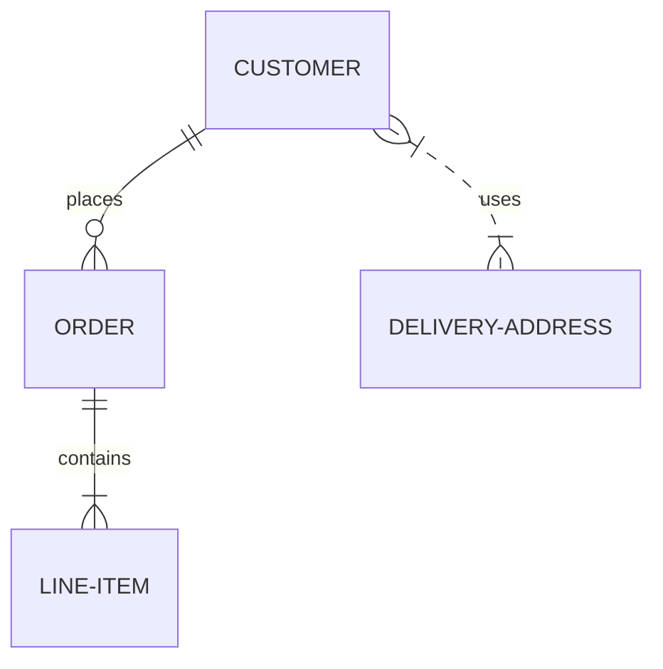

# Example ERD diagram using (mermaid)[https://github.blog/developer-skills/github/include-diagrams-markdown-files-mermaid/]

```mermaid
	erDiagram
	    CUSTOMER ||--o{ ORDER : places
	    ORDER ||--|{ LINE-ITEM : contains
	    CUSTOMER }|..|{ DELIVERY-ADDRESS : uses
```
